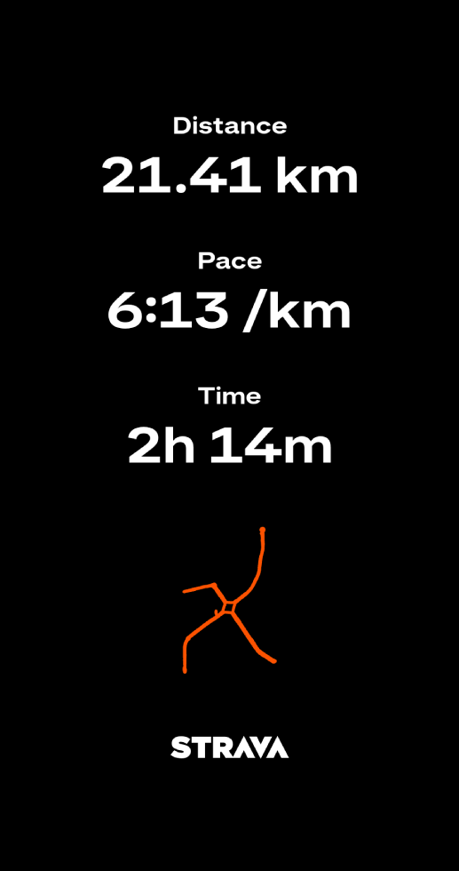
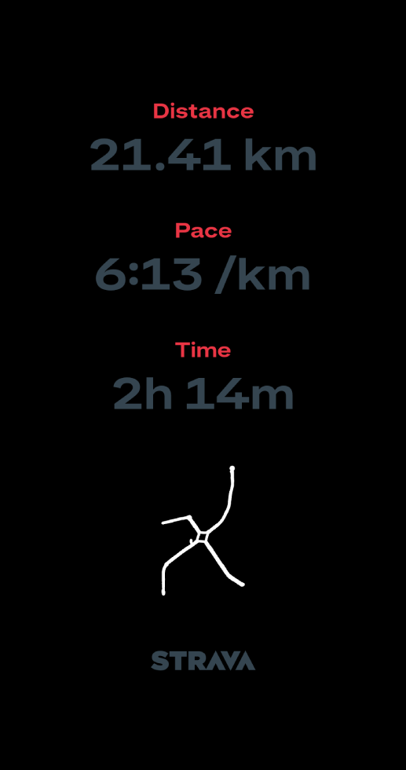
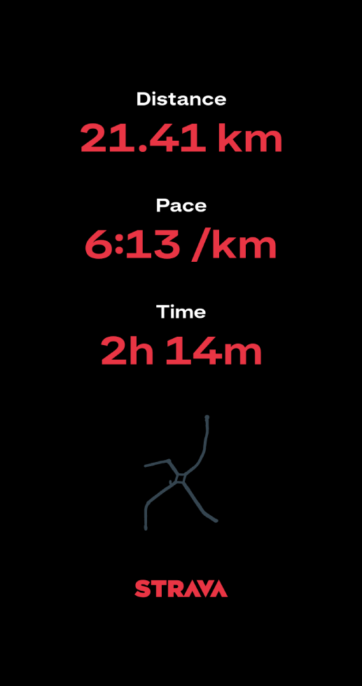
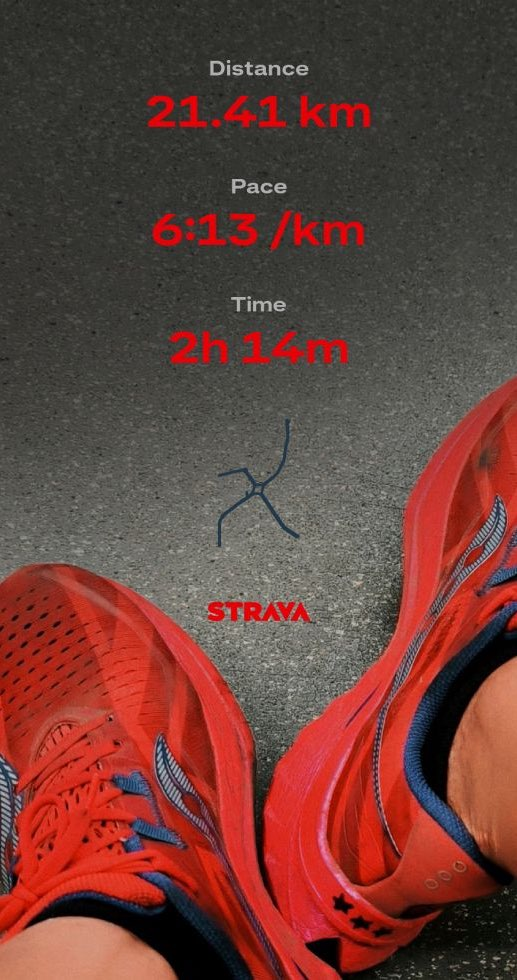

# StravaChroma

[](https://github.com/thebennies/StravaChroma/actions/workflows/ci.yml)
[](LICENSE)

Personalize your run. Turn boring Strava share images into vibrant artworks — client-side, no uploads, no watermarks.

<table>
  <tr>
    <td align="center"><br><b>Original</b></td>
    <td align="center"><br><b>Colorways</b></td>
    <td align="center"><br><b>Customize</b></td>
    <td align="center"><br><b>Apply</b></td>
  </tr>
</table>

## Features

- **Pixel classification** — automatically separates map, data, and label pixels using connected-component analysis and Otsu thresholding
- **Independent layer controls** — tune hue and saturation for the map, data, and label layers separately with HSL sliders
- **500+ colorways** — curated palettes grouped by running brands, sports teams, sneakers, luxury brands, IDE themes, films, comics, and more; plus single-layer presets
- **Colorway search** — Cmd/Ctrl+K to find palettes fast; group filter modal to curate the list
- **Colorway favorites** — heart your go-to palettes for quick access
- **Undo / Redo** — step back and forward through color changes
- **Custom colorways** — save your own palettes to local storage
- **Experimental effects** — drop shadow, tilted gradient overlay, and optional export logo stamp
- **Live preview** — downscaled real-time preview while adjusting; full-resolution on export
- **Off-thread processing** — classification and rendering run in a Web Worker to keep the UI responsive
- **Drag-and-drop** — drop a PNG anywhere on the page to load it
- **Canvas pan/zoom** — mouse wheel, pinch-to-zoom, and double-click to fit
- **Session persistence** — IndexedDB saves your loaded image across page refreshes
- **Background options** — auto (checkerboard detection), dark, light, or custom image
- **High-res export** — full-resolution PNG download; Web Share API on mobile
- **No watermarks** — your images stay clean
- **Responsive layout** — desktop sidebar + mobile tab panels (Colorways, Manual, Actions)
- **100% private** — everything runs in the browser; nothing is uploaded

## Browser compatibility

| Browser | Minimum version |
|---------|----------------|
| Chrome  | 80+            |
| Firefox | 79+            |
| Safari  | 15+            |
| Edge    | 80+            |

Requires `createImageBitmap`, Web Workers, `OffscreenCanvas`, and ES2020 modules.

## Tech stack

- Vanilla JS (ES modules) — no framework, no TypeScript
- [Vite 8](https://vitejs.dev/) — bundler and dev server
- [Tailwind CSS v4](https://tailwindcss.com/) — styling
- [Lucide](https://lucide.dev/) — icons
- Web Workers + OffscreenCanvas — off-thread pixel processing
- IndexedDB — session persistence
- [PostHog](https://posthog.com/) — analytics

## Getting started

```bash
# Requires Node 18+ and pnpm
pnpm install
pnpm dev       # http://localhost:5173
pnpm test      # run unit tests
pnpm build     # output to dist/
pnpm preview   # serve the production build locally
```

## How it works

1. **Load** — drop or select a Strava map screenshot (PNG, max 1 MB), or try the built-in demo image
2. **Classify** — a Web Worker scans every pixel and assigns it to one of four categories:
   - `transparent` — ignored
   - `map` — colored background pixels (high saturation)
   - `data` — route/activity data pixels
   - `label` — near-white, low-saturation text and label pixels
3. **Render** — the worker applies HSL shifts to each layer based on the current slider values and returns pixel data
4. **Export** — re-renders at full resolution and triggers a PNG download

## Versioning

This project uses **CalVer** — `YYYY.MM.PATCH`.

- `YYYY` — 4-digit year
- `MM` — 2-digit month (01-12)
- `PATCH` — starts at `0` each month; increments only when multiple releases ship in the same month

The version is set in `package.json` and injected at build time by Vite, so it is frozen per build (no `new Date()` at runtime). To bump the version before a release:

```bash
pnpm run version:bump
```

## Contributing

See [CONTRIBUTING.md](CONTRIBUTING.md) for setup instructions and coding conventions.

## License

[MIT](LICENSE) © thebennies
